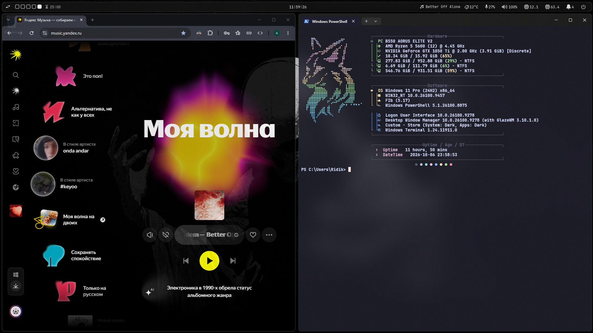

<div align="center">

# YASB × GlazeWM

### Minimal monochrome Windows setup built around YASB and GlazeWM.

[](https://www.microsoft.com/windows)
[](https://github.com/glzr-io/glazewm)
[](https://github.com/amnweb/yasb)

A clean, keyboard-driven Windows environment with tiling window management, a custom status bar, workspace integration and a neutral graphite UI.

</div>



---

## Overview

This repository contains my personal configuration for:

- [GlazeWM](https://github.com/glzr-io/glazewm) — tiling window manager for Windows
- [YASB](https://github.com/amnweb/yasb) — customizable Windows status bar

The setup is designed around a minimal monochrome aesthetic:

- graphite / silver / white palette
- rounded translucent YASB bar
- keyboard-first window management
- 9 GlazeWM workspaces
- active window tracking
- media controls
- audio visualizer
- weather
- Pomodoro timer
- CPU and RAM monitoring
- volume and microphone controls
- notification counter
- custom power menu

---

## Repository Structure

```text
YASB-GlazeWM/
├── preview.png
│
├── GlazeWM/
│   └── config.yaml
│
├── YASB/
│   ├── config.yaml
│   └── styles.css
│
└── README.md
```

---

## YASB

The bar is split into three sections.

### Left

```text
Tiling Direction · Workspaces · Pomodoro · Active Window
```

### Center

```text
Clock
```

### Right

```text
CAVA · Media · Weather · Microphone · Volume · CPU · RAM · Notifications · Power
```

The theme uses a neutral monochrome palette with translucent surfaces and rounded corners.

```css
background-color: rgba(18, 18, 18, 0.64);
border: 1px solid rgba(178, 178, 178, 0.20);
```

---

## GlazeWM

The configuration provides:

- `9` workspaces
- automatic tiling
- `10px` inner gaps
- subtle outer gaps
- focused window border
- reduced opacity for unfocused windows
- cursor jump between monitors
- Vim-style navigation
- workspace navigation with `Alt + 1..9`
- fast switching between tiled, floating and fullscreen modes

---

## Keybindings

| Action | Shortcut |
| --- | --- |
| Focus left | `Alt + H` / `Alt + ←` |
| Focus right | `Alt + L` / `Alt + →` |
| Focus up | `Alt + K` / `Alt + ↑` |
| Focus down | `Alt + J` / `Alt + ↓` |
| Move window | `Alt + Shift + H/J/K/L` |
| Resize width | `Alt + U` / `Alt + P` |
| Resize height | `Alt + I` / `Alt + O` |
| Resize mode | `Alt + R` |
| Toggle floating | `Alt + Shift + Space` |
| Toggle tiling | `Alt + T` |
| Toggle fullscreen | `Alt + F` |
| Minimize | `Alt + M` |
| Close window | `Alt + Shift + Q` |
| Toggle tiling direction | `Alt + V` |
| Cycle focus mode | `Alt + Space` |
| Open Windows Terminal | `Alt + Enter` |
| Previous active workspace | `Alt + A` |
| Next active workspace | `Alt + S` |
| Recent workspace | `Alt + D` |
| Workspace 1–9 | `Alt + 1..9` |
| Move window to workspace | `Alt + Shift + 1..9` |
| Reload GlazeWM config | `Alt + Shift + R` |
| Pause GlazeWM | `Alt + Shift + P` |
| Exit GlazeWM | `Alt + Shift + E` |

---

## Installation

### 1. Install GlazeWM

Using WinGet:

```powershell
winget install GlazeWM
```

Official repository:

https://github.com/glzr-io/glazewm

---

### 2. Install YASB

Using WinGet:

```powershell
winget install --id AmN.yasb
```

Official repository:

https://github.com/amnweb/yasb

---

### 3. Install the fonts

The configuration uses:

- **JetBrainsMono Nerd Font**
- **Segoe Fluent Icons**

YASB's setup wizard can install the required fonts automatically.

Nerd Fonts:

https://www.nerdfonts.com/

---

### 4. Clone this repository

```powershell
git clone https://github.com/Neurozepam/YASB-GlazeWM.git
cd YASB-GlazeWM
```

---

### 5. Install the GlazeWM config

Default GlazeWM configuration directory:

```text
%USERPROFILE%\.glzr\glazewm\
```

PowerShell:

```powershell
New-Item -ItemType Directory -Force "$HOME\.glzr\glazewm"

Copy-Item `
    ".\GlazeWM\config.yaml" `
    "$HOME\.glzr\glazewm\config.yaml" `
    -Force
```

---

### 6. Install the YASB config

Default YASB configuration directory:

```text
%USERPROFILE%\.config\yasb\
```

PowerShell:

```powershell
New-Item -ItemType Directory -Force "$HOME\.config\yasb"

Copy-Item `
    ".\YASB\config.yaml" `
    "$HOME\.config\yasb\config.yaml" `
    -Force

Copy-Item `
    ".\YASB\styles.css" `
    "$HOME\.config\yasb\styles.css" `
    -Force
```

---

## Weather Configuration

The weather widget requires a [WeatherAPI](https://www.weatherapi.com/) API key.

Open:

```text
YASB/config.yaml
```

Find:

```yaml
weather:
  type: "yasb.weather.WeatherWidget"
  options:
    api_key: "<Place your API-KEY here (weatherapi is free btw)>"
```

Replace it with your key:

```yaml
api_key: "YOUR_API_KEY"
```

The current configuration uses:

```yaml
location: "Saint Petersburg, Russia"
```

Change it if needed.

---

## Reloading

### YASB

The config and stylesheet have file watching enabled, so most changes can be picked up automatically.

You can also restart YASB from its tray icon.

### GlazeWM

Reload the configuration with:

```text
Alt + Shift + R
```

---

## Customization

Most visual customization lives in:

```text
YASB/styles.css
```

Main colors:

```text
Background    #121212
Primary text  #e0e0e0
Active        #f0f0f0
Secondary     #bcbcbc
Inactive      #858585
```

GlazeWM behavior and keyboard shortcuts are configured in:

```text
GlazeWM/config.yaml
```

YASB widgets and their behavior are configured in:

```text
YASB/config.yaml
```

---

<div align="center">

### Windows doesn't have to look like Windows.

**YASB × GlazeWM**

</div>
